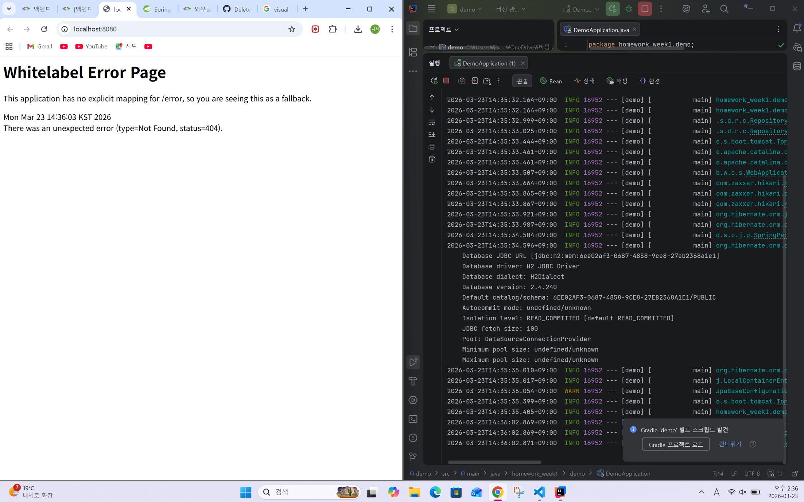

====Spring Boot 애플리케이션을 실행하고, 브라우저에 localhost:8080 을 입력했을 때 나오는 Whitelabel Error Page 스크린샷====

====온라인 쇼핑몰 프로젝트의 API 명세서를 직접 설계하기=====
-회원 기능
    • 회원 등록
        HTTP Method : POST
        URI : /members
        
    • 회원 목록 조회
        HTTP Method : GET
        URI : /members

    • 개별 회원 정보 상세 조회
        HTTP Method : GET
        URI : /members/{number}
    
    • 회원 정보 수정
        HTTP Method : PATCH
        URI : /members/{number}
        
    • 회원 삭제
        HTTP Method : DELETE
        URI : /members/{number}

-상품 기능
    • 상품 정보 등록
        HTTP Method : POST
        URI : /object

    • 상품 목록 조회
        HTTP Method : GET
        URI : /object

    • 개별 상품 정보 상세 조회
        HTTP Method : GET
        URI : /object/{number}

    • 상품 정보 수정
        HTTP Method : PATCH
        URI : /object/{number}

    • 상품 삭제
        HTTP Method : DELETE
        URI : /object/{number}

-주문 기능
    • 주문 정보 생성
        HTTP Method : POST
        URI : /order

    • 주문 목록 조회
        HTTP Method : GET
        URI : /order

    • 개별 주문 정보 상세 조회
        HTTP Method : GET
        URI : /order/{number}

    • 주문 취소
        HTTP Method : DELETE
        URI : /order{number}

====강의 내용을 요약 정리하기====

1. 웹이란?
인터넷 위에서 동작하는 서비스 중 하나
웹⊂인터넷
-웹에서 흔한 통신 구조
	클라이언트↔서버
클라이언트가 요청을 보내면 서버가 그 요청을 받아 답을 해주는 구조를 가지고 있음!
이때 요청은 URL(주소)로 요청한다.
URL이란?
웹상에서 특정 자원의 위치를 나타내는 주소
-예시 : 스터디 주소
ex)https://www.youtube.com/watch?v=wYOPwwYcdGs
HOST : 서버의 주소 혹은 도메인(www.youtube.com)
PORT : 서버의 특정 네트워크 포트 번호(일반적으로 생략한다)
PATH : 서버 내에서 원하는 리소스의 경로(watch)
QUERY : 서버에 추가 정보를 보내는 매개변수(?v=wYOPwwYcdGs)
SCHEME : 데이터를 주고 받는 방식, 통신을 하기 위한 규칙(https)

2. HTTP
서로 데이터를 어떻게 주고받을지를 결정하는 규칙
무상태성, 비연결성을 띤다.
무상태성 : 이전 요청을 저장하지 않고, 매 요청을 독립적으로 처리함
비연결성 : 클라이언트가 요청을 보내고 응답을 받은 후 서버와 연결을 유지하지 않음

-HTTP의 주요 메서드
GET 리소스 조회
POST 리소스 추가, 등록
PUT 리소스 교체, 없으면 새로 생성
PATCH 리소스의 일부를 수정
DELETE 리소스를 삭제

-HTTP의 주요 상태 코드
200 OK 요청 성공
201 CREATED 요청성공+새로운 리소스 생성
400 BAD REQUEST  클라이언트 요청이 잘못되어 서버가 이해하지 못함
404 NOT FOUND 지정한 리소스를 찾을 수 없음
500 INTERNAL SERVER ERROR 서버 내부 오류로 요청을 처리할 수 없음

3. API와 REST API
HTTP는 보내는 규칙만 정해줄 뿐, 방식과 경로 형식 등은 알려줄 수 없다. 
이때 방식과 경로 형식 등을 알려주는 규칙 중 하나를 API라고 한다. 
그중 REST 원칙을 준수해 만든 모범 사례를 REST API라고 한다.
  -REST 원칙
	1. URI-자원(Resource) : 고유한 URI로 식별
	2.METHOD-행위(Verb) : HTTP 메서드 사용
	3. 표현(Representation)- JSON이 일반적임 : 자바에 기반을 둔 매우 간단한 구조

4. Spring Boot
Spring이란?
JAVA로 대규모 개발을 할 때 편리하게 사용하며, 객체 지향을 잘 살려내서 좋은 객체 지향 프로그램을 개발할 수 있도록 도와준다. 
객체 지향이란?
프로그램을 객체 단위로 나눠서 설계하고 개발하는 방식을 말한다. 
현실처럼 데이터(속성) + 행동(기능)을 하나로 묶어서 다루는 방식을 말한다.
이것들을 아주 빠르고 쉽게 사용할 수 있게 해주는 도구를 Spring Boot라고 한다.
